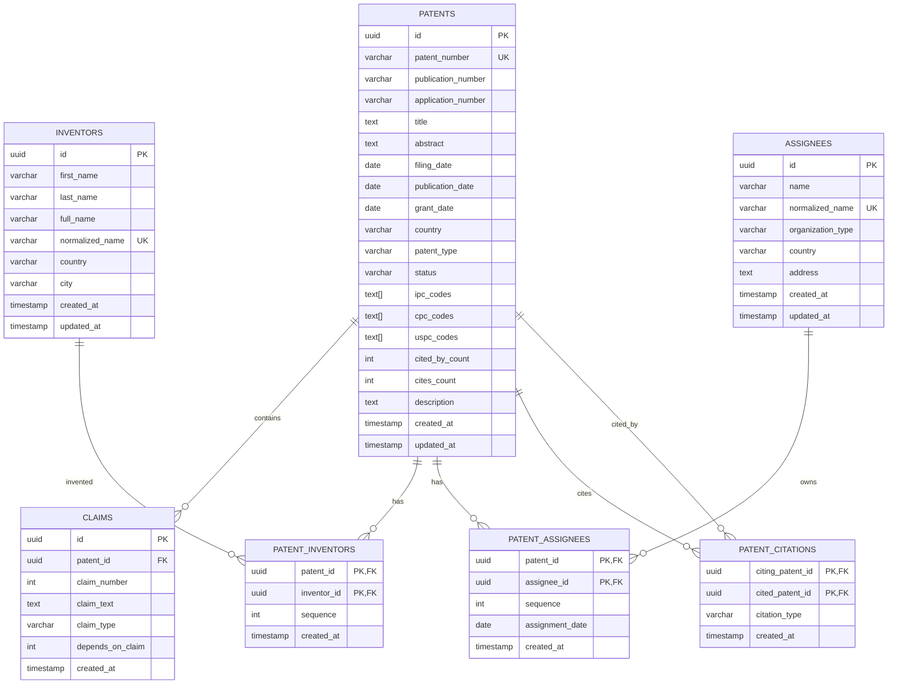
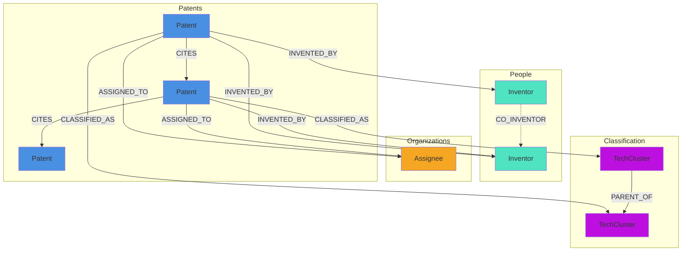
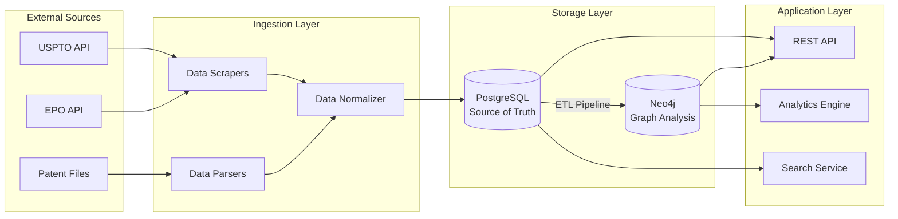
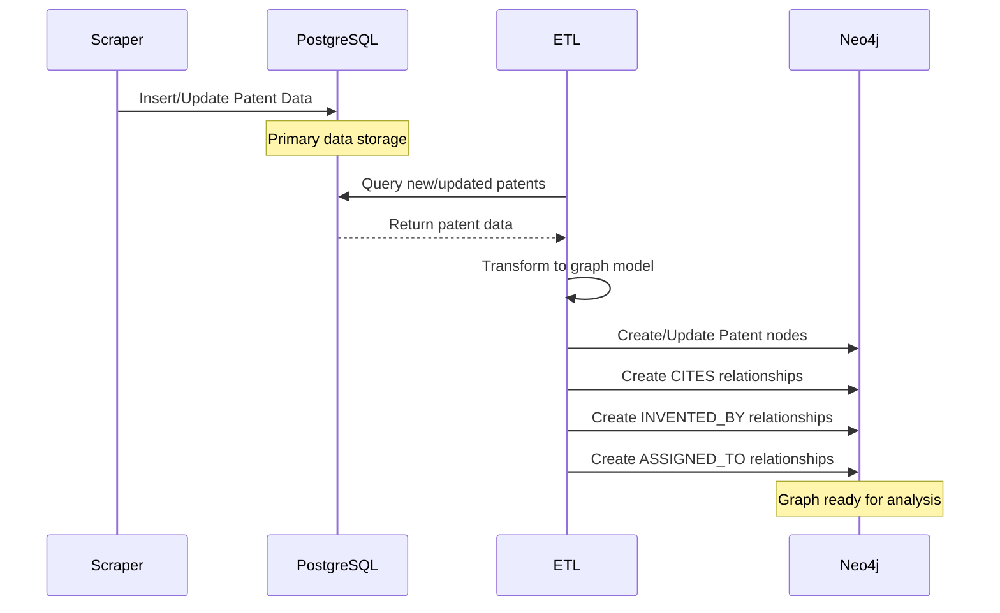

# Database Schema Documentation

## PostgreSQL Schema Diagram



## Neo4j Graph Schema



## Data Flow Architecture



## Key Design Decisions

### PostgreSQL (Relational Database)

**Purpose**: Source of truth for all patent data

**Why PostgreSQL?**
- Strong ACID guarantees for data integrity
- Excellent full-text search capabilities with pg_trgm
- Mature ecosystem with robust tooling
- Efficient storage and indexing for structured data
- Support for JSON/JSONB for semi-structured data
- Array types for classification codes

**Use Cases**:
- Storing complete patent metadata
- Full-text search across patent titles, abstracts, descriptions
- Claims analysis and retrieval
- Inventor and assignee management
- Citation storage and querying
- Primary data source for APIs

### Neo4j (Graph Database)

**Purpose**: Optimized for citation network analysis and graph queries

**Why Neo4j?**
- Native graph storage and processing
- Optimized for traversal queries (citation chains, shortest paths)
- Built-in graph algorithms (PageRank, community detection, centrality)
- Cypher query language for intuitive graph queries
- APOC library for advanced graph operations
- Graph Data Science library for ML and analytics

**Use Cases**:
- Citation network analysis
- Finding influential patents (PageRank, betweenness centrality)
- Patent clustering and community detection
- Technology landscape mapping
- Co-inventor network analysis
- Patent portfolio analysis
- Finding citation chains and relationships

### Hybrid Architecture Benefits

1. **Separation of Concerns**: Relational for structured data, graph for relationships
2. **Performance**: Each database optimized for its specific queries
3. **Scalability**: Can scale each database independently
4. **Flexibility**: PostgreSQL for OLTP, Neo4j for OLAP/analytics
5. **Best of Both Worlds**: SQL for complex joins, Cypher for graph traversals

## Data Synchronization Strategy



**Sync Process**:
1. All data ingestion goes to PostgreSQL first
2. ETL pipeline runs periodically (or triggered by events)
3. Changed records synced to Neo4j
4. Neo4j nodes reference PostgreSQL UUIDs
5. Graph metrics computed and stored in Neo4j

## Index Strategy

### PostgreSQL Indexes

**B-Tree Indexes**: Default for equality and range queries
- `patent_number`, `filing_date`, `grant_date`, `country`, `status`

**GIN Indexes**: For array and full-text search
- `ipc_codes`, `cpc_codes` (array fields)
- `title`, `abstract` (trigram search)

**Composite Indexes**: For common query patterns
- `(patent_id, claim_number)` on claims table
- `(citing_patent_id)`, `(cited_patent_id)` on citations

### Neo4j Indexes

**Unique Constraints**: Automatic indexes
- `Patent.patent_number`, `Patent.id`
- `Inventor.id`, `Assignee.id`

**Property Indexes**: For filtering
- `Patent.filing_date`, `Patent.country`, `Patent.status`
- `Inventor.normalized_name`, `Assignee.normalized_name`

**Full-text Indexes**: For text search
- `Patent.title`, `Patent.abstract`

## Sample Queries

### PostgreSQL Queries

```sql
-- Find all patents by an assignee with their inventors
SELECT
    p.patent_number,
    p.title,
    p.filing_date,
    ARRAY_AGG(i.full_name) as inventors
FROM patents.patents p
JOIN patents.patent_assignees pa ON p.id = pa.patent_id
JOIN patents.assignees a ON pa.assignee_id = a.id
LEFT JOIN patents.patent_inventors pi ON p.id = pi.patent_id
LEFT JOIN patents.inventors i ON pi.inventor_id = i.id
WHERE a.normalized_name = 'apple_inc'
    AND p.grant_date >= '2020-01-01'
GROUP BY p.id
ORDER BY p.grant_date DESC;

-- Find patents citing a specific patent
SELECT
    citing.patent_number,
    citing.title,
    citing.grant_date,
    pc.citation_type
FROM patents.patent_citations pc
JOIN patents.patents citing ON pc.citing_patent_id = citing.id
JOIN patents.patents cited ON pc.cited_patent_id = cited.id
WHERE cited.patent_number = 'US-10000001-B2'
ORDER BY citing.grant_date DESC;

-- Full-text search for patents
SELECT
    patent_number,
    title,
    abstract,
    ts_rank(to_tsvector('english', title || ' ' || abstract),
            to_tsquery('english', 'machine & learning')) as rank
FROM patents.patents
WHERE to_tsvector('english', title || ' ' || abstract)
      @@ to_tsquery('english', 'machine & learning')
ORDER BY rank DESC
LIMIT 20;
```

### Neo4j Queries

```cypher
// Find most influential patents (PageRank)
CALL gds.graph.project(
    'citation-network',
    'Patent',
    {CITES: {orientation: 'REVERSE'}}
);

CALL gds.pageRank.stream('citation-network')
YIELD nodeId, score
WITH gds.util.asNode(nodeId) AS patent, score
RETURN patent.patent_number, patent.title, score
ORDER BY score DESC
LIMIT 10;

// Find citation chain between two patents
MATCH path = shortestPath(
    (p1:Patent {patent_number: 'US-10000001-B2'})
    -[:CITES*]->
    (p2:Patent {patent_number: 'US-9000000-B2'})
)
RETURN [node IN nodes(path) | node.patent_number] AS citation_chain;

// Find co-inventor networks
MATCH (p:Patent)-[:INVENTED_BY]->(i1:Inventor)
MATCH (p)-[:INVENTED_BY]->(i2:Inventor)
WHERE i1 < i2
WITH i1, i2, COUNT(p) AS collaborations, COLLECT(p.patent_number) AS patents
WHERE collaborations >= 3
MERGE (i1)-[r:CO_INVENTOR]-(i2)
SET r.collaboration_count = collaborations,
    r.patents = patents
RETURN i1.full_name, i2.full_name, collaborations;

// Detect patent communities
CALL gds.louvain.write('citation-network', {
    writeProperty: 'community_id'
});

MATCH (p:Patent)
RETURN p.community_id AS community,
       COUNT(*) AS patent_count,
       COLLECT(p.patent_number)[0..5] AS sample_patents
ORDER BY patent_count DESC;
```

## Schema Evolution

### Adding New Fields

**PostgreSQL**:
```sql
ALTER TABLE patents.patents ADD COLUMN new_field VARCHAR(100);
CREATE INDEX idx_patents_new_field ON patents.patents(new_field);
```

**Neo4j**:
```cypher
// Schema-optional: Just start adding properties
MATCH (p:Patent) WHERE p.patent_number = 'US-10000001-B2'
SET p.new_field = 'value';

// Add index if needed
CREATE INDEX patent_new_field IF NOT EXISTS FOR (p:Patent) ON (p.new_field);
```

### Migration Best Practices

1. Always backup before migrations
2. Test migrations on dev/staging first
3. Use transactions where possible
4. Version control all schema changes
5. Document breaking changes
6. Keep PostgreSQL and Neo4j schemas in sync
7. Run data validation after migrations
